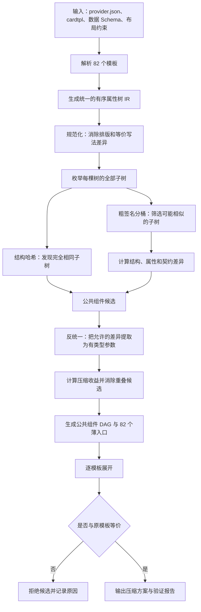

# 高级组件 DOM Tree 无损压缩算法设计方案

## 1. 背景与目标

当前项目包含 82 个高级组件形态：72 个业务模板和 10 个布局模板。它们最终都会展开为
`Text`、`Image`、`Divider`、`Progress`、`Button`、`Checkbox`、`Row`、`Column`、`List`、
`Stack` 这 10 种 Form 原子组件。

这些高级组件并不是 82 种新的端侧组件，本质上是原子组件的不同组合。当前 `.cardtpl` 中存在较多
重复展开的 DOM Tree，例如多个电池模板都重复定义了“环形进度条 + 可选图标”，只是卡片状态、尺寸、
文案或外围布局略有不同。

本方案要解决的问题是：

> 从 82 棵高级组件 DOM Tree 中自动发现完全相同或结构相似的局部树，把可安全复用的部分抽取为
> 有类型参数的公共组件，形成一张无环的组件 DAG；原有 82 个模板 ID 仍然保留，展开后的最终 DOM
> 仍与压缩前一致。

本方案压缩的是**云侧模板资产与维护成本**，不是传输文件压缩，也不修改端侧 Form 协议。

## 2. 算法流程



流程可以分成三段理解：

1. **看懂模板**：把不同文件里的模板变成统一的 DOM Tree。
2. **寻找重复**：先找完全一样的子树，再找“骨架一样、少量属性不同”的子树。
3. **证明没有改坏**：抽取公共组件后，把每个模板重新展开，逐项与压缩前结果比较。

## 3. 边界：哪些可以压缩，哪些不能动

### 3.1 不修改 Form 原子组件

10 种 Form 原子组件及其协议保持不变。公共组件只存在于云侧作者层和编译阶段，最终必须展开为
Form 允许的原子组件。

### 3.2 保留 82 个模板 ID

例如以下模板仍然是不同的受控选择项：

```text
BatteryOverviewNormalFull@1
BatteryOverviewChargingFull@1
BatteryOverviewLowFull@1
BatteryOverviewNormalHero@1
```

压缩后，它们可以引用同一个公共实现，但不能因为 DOM 相似就删除原有 ID。模板 ID 还承载尺寸、状态、
检索、选择和准入意义。

### 3.3 不压缩掉模板契约

每个模板的数据路径、数据类型、必需性、素材、动作和布局限制必须保留。公共 DOM 可以共享，
模板能否被选择仍由自己的契约决定。

### 3.4 无损压缩和视觉改版分开

本方案默认是无损压缩。如果压缩过程中顺便调整字号、布局或文案，那是另一项视觉改版，必须单独评审，
不能把它算成算法自动压缩的结果。

## 4. 输入与输出

### 4.1 输入

| 输入 | 项目来源 | 算法用途 |
|---|---|---|
| 模板清单 | `resources/source/providers/*/provider.json` | 获取模板 ID、业务归属、数据要求和入口文件 |
| 组件树 | Provider 下的 `.cardtpl` | 解析实际 DOM 结构 |
| 数据 Schema | Provider 声明的 schema | 补齐绑定的数据类型和必需性 |
| 布局声明 | Layout Provider | 获取布局尺寸、子节点和动作预算 |
| 编译器规则 | 模板编译与校验代码 | 识别不能被普通 DOM 比较覆盖的硬约束 |
| 基线结果 | 压缩前模板的展开结果 | 用于最终无损验证 |

### 4.2 第一阶段输出：候选报告

算法第一阶段只分析，不自动修改模板。每个候选公共组件输出：

```text
候选 ID：MetricRing
候选类型：精确公共子树 / 参数化公共子树
覆盖模板：哪些模板
覆盖位置：每个模板中的 DOM 路径
出现次数：多少次
公共 Pattern：抽取后的树
参数列表：参数名、类型、可选性和允许值
结构差异：新增、删除、改变多少节点
属性差异：新增、删除、改变多少属性
契约差异：是否存在类型、动作、素材或布局冲突
压缩收益：原始规模、压缩后规模、净节省
展开验证：是否可恢复原树
风险等级：低 / 中 / 高
```

### 4.3 审核通过后的输出

- 公共组件定义；
- 公共组件之间的 DAG 引用关系；
- 82 个原模板 ID 对应的薄入口；
- 每个薄入口的固定参数和数据契约；
- 压缩前后逐模板等价性报告；
- 未采用候选及其拒绝原因。

## 5. 数据结构

### 5.1 模板 DOM Tree

令第 `i` 个模板规范化后的树为：

\[
T_i=(V_i,E_i,A_i)
\]

其中：

- `V_i`：DOM 节点集合，例如 `Column`、`Text`、`Progress`；
- `E_i`：父子关系和 children 顺序；
- `A_i(v)`：节点 `v` 的属性、绑定、条件和样式。

这里必须是有序树，因为：

```text
Column(TextA, TextB)
```

和：

```text
Column(TextB, TextA)
```

虽然节点集合相同，但阅读顺序和视觉结果不同。

### 5.2 统一中间表示 IR

建议使用以下逻辑节点：

```text
Element(componentType, attributes, children)
Conditional(conditionType, condition, child)
Binding(path, valueType, requiredness)
Literal(value, valueType)
Parameter(name, valueType, allowedValues)
Expression(expressionAST)
```

例如：

```text
Text(`电量 ${data.percentText}`, "body", {"fontSize": 12})
```

解析为：

```text
Element(
  type = Text,
  attributes = {
    content: Concat(
      Literal("电量 ", string),
      Binding("/batterySOCText", string, required)
    ),
    presentationRole: "body",
    styles.fontSize: Literal(12, number)
  },
  children = []
)
```

### 5.3 模板契约

DOM Tree 之外，单独保存模板契约：

```text
TemplateContract {
  templateId
  providerId
  businessId
  layoutKind
  primaryData
  secondaryData
  optionalData
  assetConstraints
  actionConstraints
  sizeConstraints
}
```

DOM 相似度只能提出“这里可能可以共享”。模板契约决定“这里是否真的允许共享”。

### 5.4 公共组件 Pattern

抽取后的公共组件用 Pattern 表示：

```text
ComponentPattern {
  patternId
  root
  typedParameters
  optionalSlots
  expansionTree
  dependencyIds
}
```

例如：

```text
MetricRing {
  value: Binding<number>
  icon?: Asset
  diameter: Enum<29, 38, 44, 52>
  strokeWidth: Enum<4, 5, 6>
  accentColor: DesignColorToken
}
```

不允许使用任意 JSON 参数或任意 children，否则会把受控模板退化成新的自由 DSL。

### 5.5 差异计数向量

两个子树比较后，不先给出一个难解释的小数，而是输出直观差异：

```text
TreeDiff {
  insertedNodes
  deletedNodes
  changedComponentTypes
  changedParentRelations
  changedChildOrders

  addedAttributes
  deletedAttributes
  changedAttributes

  addedBindings
  deletedBindings
  changedBindings

  contractViolations
}
```

这个结构既供算法计算，也能直接出现在人工审核报告里。

## 6. 数据流

```text
provider.json ───────┐
                    ├─> TemplateRecord ─┐
cardtpl ─> Parser ───┘                  │
                                       ├─> CanonicalTemplate
schema ─> BindingTypeResolver ──────────┤
layout/compiler rules ─> Constraint ────┘

CanonicalTemplate
  -> SubtreeEnumerator
  -> ExactHashIndex / SimilarityBucket
  -> TreeComparator
  -> AntiUnifier
  -> CandidateSelector
  -> ComponentDAG
  -> Expander
  -> EquivalenceValidator
```

数据在整个过程中分成两条线：

- **结构线**：处理 DOM、属性和公共子树；
- **契约线**：处理数据、素材、动作、尺寸和布局约束。

两条线在候选准入和最终验证时汇合。结构线不能单独决定压缩。

## 7. 算法阶段一：解析与规范化

### 7.1 为什么不能直接比较源码文本

下面两个对象文本不同，但语义相同：

```text
{"width": 52, "height": 52}
{"height": 52, "width": 52}
```

如果直接做文本相似度，会把换行、缩进和属性顺序当成真实差异。算法必须先解析为 AST/DOM，再比较。

### 7.2 规范化规则

- 属性按照固定键顺序排列；
- 统一颜色格式、数字格式和单位；
- 默认值采用统一策略：要么统一补齐，要么统一省略；
- 文本插值解析为表达式 AST；
- 条件节点统一为同一种 IR；
- 数据路径附带 schema 类型和必需/可选标记；
- 去掉空白、注释和临时组件 ID；
- 保留 children 顺序和父子关系；
- 不把固定文案与动态绑定归为同一种值。

### 7.3 规范化结果

每个模板得到：

```text
CanonicalTemplate {
  contract
  rootTree
  nodeCount
  attributeCount
  maxDepth
  bindingSummary
  canonicalHash
}
```

## 8. 算法阶段二：完全相同子树去重

### 8.1 自底向上的结构哈希

对每个节点计算：

\[
H(v)=Hash(type(v),attrs(v),H(c_1),H(c_2),\ldots,H(c_k))
\]

其中 `attrs(v)` 已经规范化，`c_1 ... c_k` 保持原 children 顺序。

叶子节点先得到哈希；父节点只依赖自己的类型、属性和子节点哈希，因此可以自底向上一次完成。

### 8.2 为什么近似是 O(N)

令 `N` 为 82 个模板中全部 DOM 节点数。每个节点只做一次以下工作：

1. 读取自身组件类型和规范化属性；
2. 读取已经算好的 children 哈希；
3. 生成自己的哈希；
4. 在哈希表中查找或登记同哈希节点。

哈希表平均查询和插入为 `O(1)`，全部 `N` 个节点各处理一次，所以平均时间复杂度为：

\[
O(N)
\]

这就是 DOM hash-consing：内容相同的节点被 intern 到同一个结构对象中。为防止哈希碰撞，命中后仍要做一次
完整规范化内容比较；这不会改变通常情况下的近似线性结论。

### 8.3 精确候选的收益门槛

不是所有重复小节点都值得抽成组件。候选 `S` 的净节省可表示为：

\[
Saving(S)=occurrence(S)\times size(S)-definitionCost(S)-referenceCost(S)
\]

其中：

- `occurrence(S)`：出现次数；
- `size(S)`：一次完整定义的规模；
- `definitionCost(S)`：新建公共组件的定义成本；
- `referenceCost(S)`：各模板引用它并传参的成本。

建议第一版满足以下任一规模条件，并且净节省大于最低阈值：

- 出现至少 3 次；
- 或出现 2 次但子树较大；
- 抽取后总代码规模有明显下降；
- 不把一个有明确业务含义的单行文本单独包装成公共组件。

### 8.4 Battery 精确重复例子

在多个电池模板中可以看到类似结构：

```text
Stack
├── Progress(
│     value = data.percent,
│     total = 100,
│     type = "ring",
│     width = 52,
│     height = 52
│   )
└── IfPresent(batteryIcon)
    └── Image(batteryIcon, width = 24, height = 24)
```

若规范化后组件、属性、绑定和条件完全一致，结构哈希相同，可以直接共享为一个精确公共子树。

## 9. 算法阶段三：相似子树发现

精确重复只能覆盖完全一样的部分。剩余模板还可能是“结构相同，少量属性不同”，需要继续比较。

### 9.1 先分桶，再做精确比较

如果把所有子树两两比较，数量会快速增长。先为每个子树生成粗签名：

```text
根组件类型
节点数区间
最大深度
组件类型直方图
children 数量
绑定类型直方图
条件节点数量
是否包含 Action
```

只有签名相近的子树才进入下一步。可以使用普通哈希分桶；规模扩大后再考虑 MinHash/LSH。

### 9.2 当前版本的比较维度

当前启用：

- 结构差异；
- 属性差异；
- 数据绑定与契约差异。

设计保留但暂不启用：

- 语义相似度。

## 10. 结构差异：树编辑过程

### 10.1 T_i 和 TED 的含义

`T_i` 是第 `i` 个模板规范化后的 DOM Tree。对于树中的任意两个子树 `u`、`v`：

```text
TED(u, v)
```

表示把 `u` 变成 `v` 所需的最小树编辑过程。这里不直接采用一张大量小数权重表，而是记录实际发生了
多少结构变化。

### 10.2 结构差异计数

```text
P_structure =
  insertedNodes
  + deletedNodes
  + changedComponentTypes
  + changedParentRelations
  + changedChildOrders
```

归一化：

\[
P_{structure}^{norm}=
\frac{P_{structure}}{|V_u|+|V_v|}
\]

数值越小，表示骨架越接近。

### 10.3 有序 children 的动态规划

设：

```text
u.children = [a_1, a_2, ..., a_m]
v.children = [b_1, b_2, ..., b_n]
```

对 children 序列计算最小编辑过程：

\[
D[p,q]=min\begin{cases}
D[p-1,q]+delete(a_p)\\
D[p,q-1]+insert(b_q)\\
D[p-1,q-1]+TED(a_p,b_q)
\end{cases}
\]

实现可以采用 Zhang–Shasha 或 APTED，但输出不是只有一个距离值，还要保留对应编辑脚本：新增了什么、
删除了什么、哪一层父子关系发生了变化。

### 10.4 允许、受限和禁止的结构变化

| 结构变化 | 处理方式 |
|---|---|
| 同类型节点之间比较 | 允许 |
| 增删普通展示叶子 | 计入结构差异 |
| 增删布局容器 | 计入结构差异，并受到更严格阈值限制 |
| 改变父子关系 | 单独记录，不能被属性相似掩盖 |
| 改变 children 顺序 | 单独记录，因为阅读顺序会变化 |
| `Row` 和 `Column` 互换 | 默认禁止自动参数化 |
| `Progress` 改 `Text` | 禁止自动参数化 |
| Action 节点增删或换位 | 作为契约冲突，直接拒绝 |

### 10.5 Battery：Full 与 Hero 的结构比较

`BatteryOverviewNormalFull@1` 可简化为：

```text
Column
├── Text("设备电量", subtitle)
├── Text("电量 ${percentText}，${level}，${charging}", body)
└── Stack
    └── RingBlock
```

`BatteryOverviewNormalHero@1` 可简化为：

```text
Column
└── Column
    ├── RingBlock
    └── Column
        └── Text(level, body)
```

比较整棵树会得到类似差异：

```text
新增布局容器：2
删除标题节点：1
删除摘要节点：1
新增状态文本：1
父子关系变化：若干
```

这说明 Full 和 Hero 的完整展示骨架不同，不适合直接合成同一个大模板。

但算法还会比较所有局部子树：

```text
NormalFull.Bottom.RingBlock
NormalHero.Center.RingBlock
```

这两个局部子树可能没有结构差异，因此仍可抽取公共 `MetricRing`。算法关心的是“哪一块能共享”，
不是简单判断“两张卡整体像不像”。

## 11. 属性差异

### 11.1 属性差异计数

对已经完成节点对齐的同类节点，统计：

```text
P_attribute =
  addedAttributes
  + deletedAttributes
  + changedAttributes
```

归一化：

\[
P_{attribute}^{norm}=
\frac{P_{attribute}}{|A_u|+|A_v|}
\]

这里不规定“颜色变化等于 0.2、尺寸变化等于 0.3”。报告直接显示改变了几个属性、分别是什么。

### 11.2 属性分类

#### 可以参数化

- 同类型数据值；
- 颜色 token；
- 有限枚举内的字号、宽高、间距和圆角；
- 白名单中的可选素材；
- 不改变业务职责的受控文案参数。

#### 需要额外条件

- 数据绑定路径变化：两边 schema 类型和展示角色必须兼容；
- 必需值和可选值：不能把必需值偷偷放宽成可选值；
- 条件节点：只能抽成受控的可选槽位；
- 表达式：AST 类型和允许操作必须一致。

#### 禁止自动参数化

- 任意 `styles` 对象；
- 任意 children；
- 动作节点、动作参数和动作位置；
- 固定业务标题与任意动态正文之间互换；
- 协议不允许的组件或属性。

### 11.3 Battery RingBlock 属性比较

假设两个环形指标为：

```text
A: Progress(value=/batterySOC, color=amber, width=52, height=52)
B: Progress(value=/memory/usagePercent, color=green, width=44, height=44)
```

报告为：

```text
新增属性：0
删除属性：0
改变属性：4
  value
  color
  width
  height
```

进一步检查：

- 两个 `value` 是否都是 `Binding<number>`；
- 是否都代表 `Progress` 允许的范围；
- 两种颜色是否来自允许 token；
- 44 和 52 是否属于公共组件声明的尺寸枚举。

全部满足时，可以抽取：

```text
MetricRing(value, accentColor, diameter)
```

否则仍保留为不同结构。

## 12. 数据绑定与契约差异

### 12.1 契约差异是硬门槛

```text
P_contract =
  数据类型冲突数
  + 必需/可选冲突数
  + 非法素材变化数
  + 动作变化数
  + 尺寸或布局约束冲突数
```

规则是：

```text
P_contract > 0
=> 自动压缩候选拒绝
```

不能让“结构很像”或“节省很多代码”抵消契约冲突。

### 12.2 绑定变化的三种情况

#### 可作为参数

```text
Binding<number>("/batterySOC")
Binding<number>("/memory/usagePercent")
```

如果公共组件只负责显示数值，并且两者范围满足同一组件要求，可以抽成 `Binding<number>` 参数。

#### 需要保留薄入口契约

```text
模板 A：字段必需
模板 B：同类型字段可选
```

公共视觉组件可以支持可选参数，但模板 A 的薄入口仍必须要求该字段存在；不能把 A 的准入条件放宽。

#### 直接拒绝

```text
Binding<number>
Binding<string>
```

或者一个模板需要动作，另一个模板没有动作。这些不能靠普通参数化解决。

## 13. 语义相似度：保留设计，当前关闭

### 13.1 设计上的位置

未来可以为节点或子树生成：

```text
SemanticSignature {
  renderRole
  bindingRole
  displayRole
  interactionRole
  businessDomain
}
```

理论上可计算：

\[
S_{semantic}=
w_rS_{renderRole}+
w_bS_{bindingRole}+
w_iS_{interactionRole}+
w_dS_{domain}
\]

### 13.2 当前版本为什么不启用

当前项目有稳定的 DOM、schema、数据必需性和业务归属，但还没有覆盖完整、口径统一的语义标签。
如果让模型根据字段名、文案猜“两个组件是不是同一语义”，会把不确定性带入无损压缩决策。

因此当前版本明确设置：

```text
w_semantic = 0
```

- 数据结构中保留语义签名接口；
- 报告可以展示现有业务域和展示角色；
- 不参与候选筛选；
- 不参与排序；
- 不参与是否合并的决定。

### 13.3 未来启用条件

只有业务字段具备稳定的结构化标签，例如：

```text
valueKind = percentage
businessMeaning = battery-level
displayRole = primary-metric
unit = percent
```

并且标签覆盖率、准确率经过验证后，语义相似度才可用于候选召回。即使启用，也不能绕过结构、契约和
展开等价性验证。

## 14. 候选准入与排序

不把结构、属性和契约简单平均成一个总分，而是逐层过关：

```text
第一关：契约安全
P_contract 必须等于 0

第二关：结构接近
P_structure_norm 不超过结构阈值

第三关：属性差异可控
P_attribute_norm 不超过属性阈值

第四关：差异能由封闭类型参数表达
不存在 arbitrary props / arbitrary children

第五关：压缩有收益
Saving 大于最低收益

第六关：展开等价
新定义展开后与原模板一致
```

只有全部通过，才进入最终候选集。

如果需要给候选排序，可在硬门槛通过后使用：

\[
PenaltyRank=P_{structure}^{norm}+P_{attribute}^{norm}
\]

数值越小越优先。这个值只用于排序，不负责正确性判断，因此不需要维护一张复杂的小数代价表。

## 15. 反统一：生成有类型公共 Pattern

对通过初步筛选的子树做反统一，找出它们共同的最具体结构。

例如：

```text
Progress(value=A, color=amber, width=52)
Progress(value=B, color=green, width=44)
```

得到：

```text
Progress(
  value = $value,
  color = $accentColor,
  width = $diameter
)
```

同时推导参数类型：

```text
value: Binding<number>
accentColor: DesignColorToken
diameter: Enum<44, 52>
```

参数数量过多意味着公共结构过于泛化。建议设定上限：

- 参数数不能超过候选节点数的一定比例；
- 可选节点槽位数量有限；
- 不允许嵌套任意 children 槽位；
- 一个 Pattern 不能同时承担多个互斥业务职责；
- Pattern 必须至少被两个有意义的模板复用。

## 16. 候选冲突与最优选择

同一片 DOM 可能产生重叠候选：

```text
候选 A：Progress
候选 B：MetricRing
候选 C：MetricRing + 右侧两行文字
```

全部采用会造成组件层级过碎。选择目标是：

\[
\max \sum_{m\in M}x_m\cdot Saving(m)-\lambda\cdot Complexity(m)
\]

约束包括：

- 同一层的原始节点不能被多个候选重复覆盖；
- 公共组件之间不能形成循环引用；
- 参数数量和组件嵌套深度不能超过上限；
- 跨业务公共组件不能包含业务专属文案和业务契约；
- 模板根、动作槽位等保护节点不能被普通视觉 Pattern 吞掉；
- 采用候选后必须能展开回所有原模板。

第一版可使用“按净节省排序的贪心算法”：

1. 按 `Saving` 从高到低排序；
2. 依次选择不与已选候选冲突的项；
3. 选择后重新计算受影响候选的收益；
4. 最后尝试用一个大候选替换多个小候选，做局部优化。

项目规模不大，若后续确实需要全局最优，再改用整数规划。

## 17. 组件 DAG

压缩后的层次建议为：

```text
L0 Form 原子组件
   Text / Image / Progress / Row / Column / Stack / ...

L1 跨业务视觉 Pattern
   MetricRing / TitleSummary / HeroValue / IconMetric / DualMetric

L2 业务组件
   BatteryOverview / WeatherOverview / SleepOverview / ...

L3 受控模板薄入口
   BatteryOverviewChargingFull@1 / WeatherOverviewHumidityFull@1 / ...

L4 布局骨架
   HeroActionLayout / PeerPairLayout / WeatherNowForecastLayout / ...
```

DAG 边只允许从高层指向低层。建立依赖后做拓扑排序：

- 能完成拓扑排序：没有循环；
- 无法完成：存在递归引用，候选方案拒绝。

## 18. Battery 的完整应用过程

### 18.1 输入模板

电池 Provider 当前有 16 个受控形态，覆盖：

```text
状态：Normal / Charging / Low
形态：Full / Hero / WideFull / Compact
上下文：Default / Phone / Weather
```

这不表示所有状态、形态、上下文都能自由组合。合法组合仍以现有 16 个模板 ID 为准。

### 18.2 解析和规范化

每个模板被解析为：

```text
TemplateContract + Canonical DOM Tree
```

例如 `NormalFull` 的业务契约仍记录电量百分比、状态和等级等数据要求；DOM 只记录它们怎样被展示。

### 18.3 精确重复发现

结构哈希先找出多个模板中完全一样的：

```text
Progress Ring
Optional Battery Icon
某些相同的标题或摘要布局
```

这些候选可以直接 hash-cons，不需要相似度判断。

### 18.4 相似结构发现

对于尺寸不同但骨架相同的环形指标，差异报告可能为：

```text
结构变化：0
属性变化：直径、线宽、颜色
绑定类型冲突：0
契约冲突：0
```

于是反统一得到：

```text
MetricRing(value, icon?, diameter, strokeWidth, accentColor)
```

### 18.5 保留 Full 和 Hero 的区别

完整 `NormalFull` 与 `NormalHero` 有明显父子结构、文本职责和高度策略差异，所以不强行抽成一个万能
`BatteryOverview` DOM。

它们只复用底层 `MetricRing`，各自保留外层排版：

```text
BatteryFullBase
├── TitleSummary
└── MetricRing

BatteryHeroBase
├── MetricRing
└── StatusText
```

### 18.6 生成薄入口

```text
BatteryOverviewNormalFull@1
  -> BatteryFullBase(state = normal, ...)

BatteryOverviewChargingFull@1
  -> BatteryFullBase(state = charging, ...)

BatteryOverviewNormalHero@1
  -> BatteryHeroBase(state = normal, ...)
```

每个入口继续保存自己的数据要求。`state` 也必须是有限枚举，不能是任意字符串。

### 18.7 展开验证

对每个电池模板：

```text
旧 cardtpl -> 展开 -> Canonical DOM A
新薄入口 -> 展开公共 DAG -> Canonical DOM B

验证 A == B
```

通过后才能算无损压缩完成。

## 19. 应用到全部 82 个高级组件

### 19.1 建立完整基线

对 72 个业务模板和 10 个布局模板记录：

```text
模板 ID
Provider / 业务组
节点数、属性数、深度
绑定路径和类型
条件和动作数量
规范化结构哈希
压缩前最终展开结果
```

### 19.2 先业务内、后跨业务

建议按重复规模处理：

```text
电池 16
耳机 14
日历 10
天气 9
心率 8
其它业务
```

业务内抽取更安全，因为数据域和展示目标更接近。业务内稳定后，再寻找跨业务的低层视觉 Pattern。

### 19.3 跨业务候选

可能的候选包括：

```text
MetricRing：环形指标 + 可选图标
TitleSummary：标题 + 一到两行摘要
HeroValue：大数值 + 单位或说明
IconMetric：图标 + 指标值
DualMetric：两个并列指标块
```

例如电池、系统内存、健康活动、耳机电量可以共享视觉层 `MetricRing`，但业务层和数据契约仍独立。

### 19.4 10 个布局模板单独处理

布局 `.cardtpl` 虽然看起来很薄，真正差异还存在于编译器约束：

- 子节点最小和最大数量；
- 动作槽位及其位置；
- 2x2、2x4 的尺寸预算；
- 特定业务组件的放置要求；
- lowering 规则。

因此布局组件不能只按可见 DOM 进行合并。可以抽取共同的布局校验和 lowering 基础设施，但保留 10 个
布局 ID 和各自的声明。`WeatherNowForecastLayout` 这类专用布局应继续独立。

## 20. 无损验证

### 20.1 DOM 等价

对每个模板 ID：

```text
CanonicalOld(templateId) == CanonicalExpandedNew(templateId)
```

### 20.2 契约等价

逐项比较：

- 数据路径不变；
- 数据类型不变；
- 必需、次要、可选关系不变；
- Provider 和业务归属不变；
- 素材白名单与可选性不变；
- 动作类型、数量、位置和参数不变；
- 尺寸和布局预算不变。

### 20.3 协议和校验等价

- 展开后只含允许的 10 种 Form 原子组件；
- 没有新增协议外属性；
- 绑定、表达式、素材、布局和动作校验继续通过；
- 公共组件 DAG 无环；
- 原模板检索和候选选择仍能使用原 ID。

### 20.4 报告等价，而不是只报“测试通过”

每个模板输出：

```text
DOM：相同 / 不同
属性：相同 / 差异列表
绑定：相同 / 差异列表
契约：相同 / 差异列表
Validator：通过 / 失败原因
```

这样一旦失败，可以定位到具体节点和字段。

## 21. 脚本和模型的职责

| 工作 | 确定性脚本 | 模型 |
|---|---|---|
| 解析 cardtpl / JSON | 必须 | 不使用 |
| 规范化和结构哈希 | 必须 | 不使用 |
| 子树枚举和树编辑过程 | 必须 | 不使用 |
| 属性差异和绑定类型检查 | 必须 | 不使用 |
| 反统一和参数类型生成 | 必须 | 不使用 |
| 契约准入和等价性验证 | 必须 | 不使用 |
| 收益计算和候选选择 | 必须 | 不使用 |
| 给公共 Pattern 起人话名称 | 可人工完成 | 可辅助 |
| 推荐可能的跨业务候选 | 脚本为主 | 可辅助召回 |
| 语义相似度 | 当前关闭 | 不参与决策 |

模型可以建议“电池环与内存环可能相似”，但是否抽取必须由结构、类型、契约、收益和展开结果共同证明。

## 22. 复杂度

设：

- `N`：全部模板的 DOM 节点总数；
- `K`：签名分桶后真正进行近似比较的候选对子数量；
- `s`：候选子树的平均节点数。

主要阶段：

| 阶段 | 平均复杂度 | 说明 |
|---|---:|---|
| 解析与规范化 | `O(N)` | 每个节点处理一次 |
| 精确结构哈希 | `O(N)` | hash-consing，每个节点一次哈希表操作 |
| 子树签名分桶 | `O(N)` | 每个节点生成一个粗签名 |
| 近似树比较 | 取决于 `K` 和 `s` | 只比较同桶候选，避免全量两两比较 |
| DAG 拓扑检查 | `O(V_D + E_D)` | `V_D`、`E_D` 是公共组件图规模 |
| 逐模板展开验证 | `O(N')` | `N'` 是展开后的总节点数，通常与原始规模同量级 |

树编辑距离本身不是线性的，因此候选分桶非常重要。项目当前只有 82 个模板，可以先使用明确、可解释的
分桶规则，实际测量 `K` 后再决定是否引入更复杂的近似索引。

## 23. MVP 实施计划

### 第一步：只读盘点工具

- 解析 82 个模板；
- 输出规范化树、节点统计和绑定摘要；
- 建立压缩前 golden baseline；
- 不修改现有模板。

### 第二步：精确子树报告

- 实现自底向上结构哈希；
- 输出完全相同子树和净节省；
- 先分析 Battery、Earphone；
- 人工确认候选质量。

### 第三步：简单近似比较

- 实现结构、属性和契约差异向量；
- 语义相似度保持关闭；
- 只允许绑定、颜色、尺寸和可选素材四类参数化；
- 输出反统一 Pattern，不自动落地。

### 第四步：生成公共 DAG

- 审核通过的候选生成公共组件；
- 生成薄入口；
- 检查循环依赖；
- 逐模板展开验证。

### 第五步：扩展到全量与布局

- 从业务内扩展到跨业务视觉 Pattern；
- 统计真实压缩率与维护成本；
- 最后单独评估布局规则的公共基础设施；
- 不删除布局语义 ID。

## 24. 评估指标

算法不能只看“文件少了多少行”。建议同时统计：

```text
模板 ID 保留率：必须 100%
无损展开通过率：必须 100%
契约一致率：必须 100%
Validator 通过率：必须 100%

原始 DOM 节点定义总量
压缩后公共定义 + 引用 + 参数总量
净压缩率
公共组件平均复用次数
平均参数数量
最大 DAG 深度
人工拒绝候选比例及原因
```

参数很多、层级很深，即使代码行减少，也可能使维护成本上升。因此还要设置：

- 单个公共组件最大参数数；
- 最大公共组件嵌套深度；
- 最低复用次数；
- 最低净节省比例；
- 最大可选槽位数。

## 25. 最终准入标准

一个公共组件候选只有同时满足以下条件才进入正式组件 DAG：

1. 在多个模板中真实出现；
2. 结构差异低于阈值；
3. 属性差异可以用封闭、有类型的参数表达；
4. 数据、素材、动作、尺寸和布局契约没有被放宽；
5. 抽取后的净收益为正，并且没有造成过度碎片化；
6. 新入口展开后与对应原模板逐项一致；
7. 所有现有协议校验和相关测试通过；
8. 公共组件依赖图无环。

这套算法的核心不是“尽量把 82 变小”，而是：在保持 82 个受控形态和最终渲染行为不变的前提下，
让相同的 DOM 结构只维护一次，让相似结构只暴露必要且安全的差异参数。
